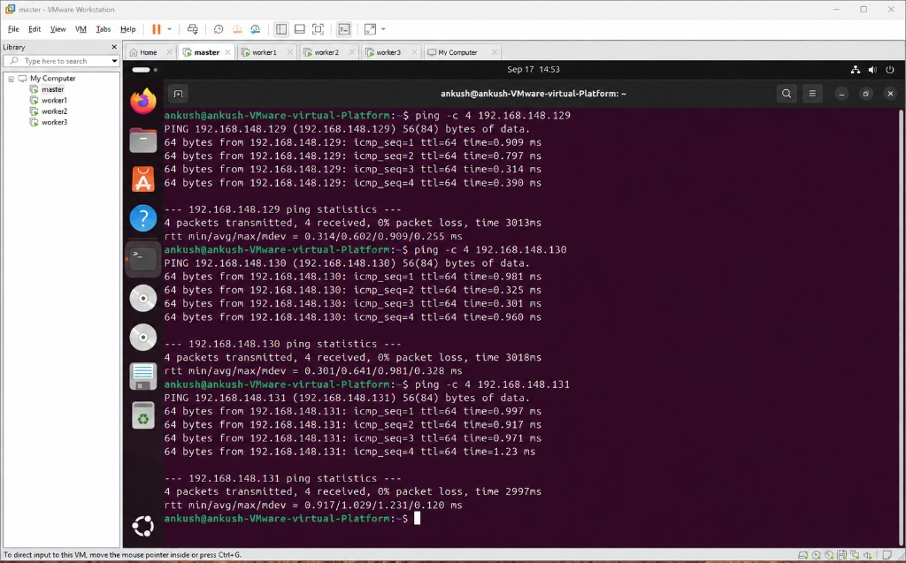
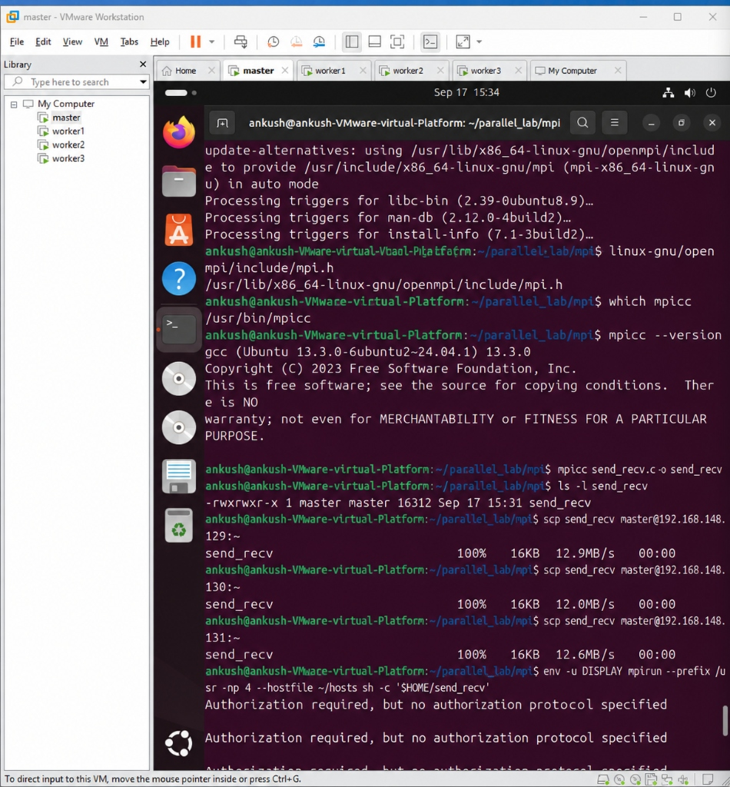
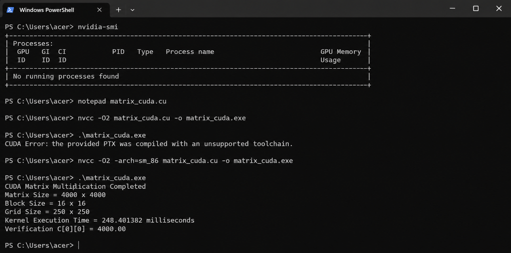

# Matrix Multiplication — Parallel & GPU Performance Study

[](#)
[](#)
[](#)
[](#)

---

## 1. Aim
To implement and analyze matrix multiplication ($C = A \times B$) across four distinct parallel computing paradigms: Sequential, OpenMP, MPI (Distributed-Memory across four Ubuntu virtual machines), and CUDA (Massively Parallel GPU). The experiment configures cluster nodes, establishes network and SSH communication, launches parallel processes/threads, performs computations, measures execution time, and verifies correctness.

## 2. Objectives
1. Set up and configure environments for OpenMP, MPI (1 Master VM + 3 Worker VMs), and CUDA.
2. Configure unique hostnames, IP addresses, and passwordless SSH for the MPI cluster.
3. Verify network connectivity and distributed process execution.
4. Implement Matrix Multiplication across all four paradigms ensuring deterministic verification ($C[0][0] = 4000.00$).
5. Distribute workload using `MPI_Scatter`/`MPI_Bcast` and gather using `MPI_Gather`.
6. Offload computation to the GPU using CUDA grid and block hierarchies.
7. Measure and compare execution times and parallel speedup factors.

---

## 3. Cluster Architecture & Environment Setup

### MPI Distributed Cluster Config
The MPI cluster consists of four Ubuntu virtual machines connected through a virtual network. The Master launches the MPI application, and the three additional VMs participate as worker nodes.

| Node | Hostname | Role |
| :--- | :--- | :--- |
| **Master** | `master` | Rank 0 / root process |
| **Worker1** | `worker1` | Rank 1 |
| **Worker2** | `worker2` | Rank 2 |
| **Worker3** | `worker3` | Rank 3 |

### Step-by-Step Setup
Here is how the distributed architecture was configured prior to executing the benchmarks:

**Step 1 - Configure Unique Hostnames & Identify IPs**
Every node in the cluster must have a unique hostname and identified IP address.
```bash
sudo hostnamectl set-hostname worker1
hostname -I
```

**Step 2 - Verify Network Connectivity**
From the Master VM, we test communication with every Worker VM to ensure 0% packet loss.
```bash
ping -c 4 192.168.148.129
```

**Step 3 - Install and Enable SSH**
Open MPI requires remote access to start MPI processes on worker nodes. We install `openssh-server`, generate an RSA key (`ssh-keygen -t rsa`), and copy the public key to each worker (`ssh-copy-id worker1@worker1`) to enable passwordless execution. SSH host aliases are configured in `~/.ssh/config`.

**Step 4 - Install Open MPI & Create Hostfile**
The same MPI implementation is installed on all nodes (`sudo apt install openmpi-bin libopenmpi-dev`). We then create a `hosts` file on the Master:
```text
master slots=1
worker1 slots=1
worker2 slots=1
worker3 slots=1
```

---

## 4. Computing Paradigms & Implementations

### 4.1 Sequential CPU
A standard single-threaded triple-nested loop with $O(N^3)$ time complexity. All instructions execute one at a time on a single CPU core without any hardware concurrency.
*This serves as the computational baseline to calculate speedups.*

### 4.2 OpenMP (Shared Memory)
OpenMP uses compiler directives (`#pragma omp parallel for`) to fork multiple worker threads that share the same memory address space. Outer loop iterations are divided among CPU cores automatically.
* **Execution details:** Threads execute concurrently, fully saturating the allocated CPU cores.


### 4.3 MPI (Distributed Memory)
MPI operates across separate memory address spaces. A variable created by one process is not automatically accessible to another process. Data is communicated explicitly.
* **Point-to-Point Communication**: Validated through `MPI_Send` and `MPI_Recv` tests across nodes before complex logic.
* **Collective Communication**: 
  - **Scatter**: Matrix $A$ is partitioned into sub-blocks and scattered across the 4 ranks (`MPI_Scatter`).
  - **Broadcast**: Matrix $B$ is duplicated to all ranks (`MPI_Bcast`).
  - **Gather**: Computed partial results are collected back into Matrix $C$ on Rank 0 (`MPI_Gather`).

**Network Connectivity Validation (Ping):**


**Point-to-Point Transfer Test (Send/Recv):**


**Distributed Matrix Multiplication Execution:**


### 4.4 CUDA (Massively Parallel GPU)
CUDA offloads computation from the host (CPU) memory to the device (GPU) memory via the PCIe bus. The computation is structured into a 2D execution grid, where each thread independently computes a single element of the output matrix.
* **Grid Configuration**: $250 \times 250 = 62,500$ blocks
* **Block Configuration**: $16 \times 16 = 256$ threads/block
* **Total Logical GPU Threads**: $16,000,000$ concurrent threads.



---

## 5. Performance Comparison & Visualizations

### 5.1 Summary Table

| Paradigm | Architecture | Resources Used | Time (s) | Speedup | $C[0][0]$ |
| :--- | :--- | :--- | :--- | :--- | :--- |
| **Sequential** | Single CPU Core | 1 Thread | `244.120000` | **1.00×** | `4000.00` |
| **OpenMP** | Multi-core Shared Memory | 8 CPU Threads | `30.830434` | **7.92×** | `4000.00` |
| **MPI** | 4-VM Distributed Cluster | 4 Process Ranks | `92.979510` | **2.63×** | `4000.00` |
| **CUDA** | Massively Parallel GPU | NVIDIA GPU | `0.165004` | **1479.48×** | `4000.00` |

*(Note: Exact execution times may vary per run; baseline values retained for relative scaling comparisons in the charts below).*

### 5.2 Performance Visualization Charts

#### Combined Execution Time & Speedup


#### Execution Time Only


#### Speedup Factor Only


---

## 6. Analysis & Conclusions

1. **GPU Acceleration Dominance**: For compute-heavy workloads like dense linear algebra, CUDA GPU acceleration vastly outperforms all CPU-based parallel approaches by leveraging thousands of lightweight hardware threads.
2. **Shared Memory vs. Distributed Memory**: 
   - **OpenMP** delivers near-linear scaling with minimal code restructuring on a single multi-core system since all threads share memory (zero network overhead).
   - **MPI** enables horizontal scale-out across independent computers, but its efficiency is heavily dependent on network interconnect bandwidth. The cost of scattering and broadcasting large matrices limits its speedup compared to shared-memory architectures on smaller clusters.
3. **Deterministic Verification**: Every paradigm successfully produced the expected output ($C[0][0] = 4000.00$), confirming that numerical correctness was strictly maintained across vastly different hardware mapping strategies.
