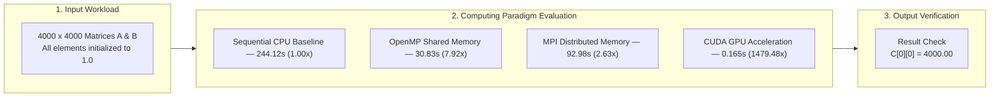
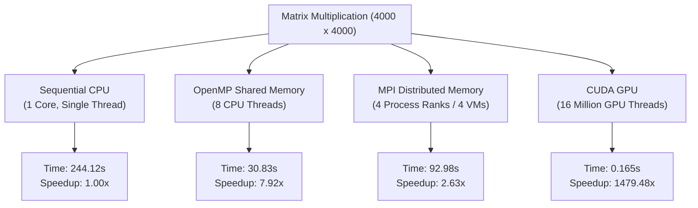
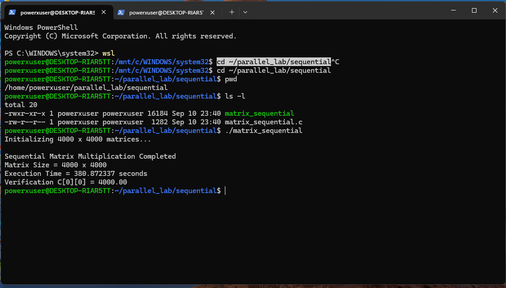
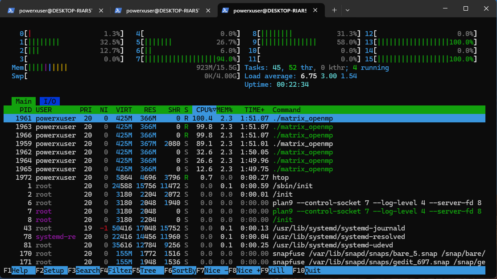
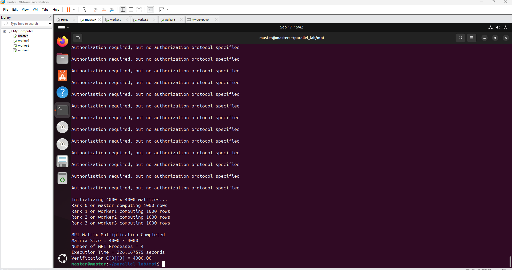

# Matrix Multiplication — Parallel & GPU Performance Study

---

## Overview

This repository documents the benchmarking, parallel implementations, and empirical results for a **$4000 \times 4000$ Matrix Multiplication** ($C = A \times B$) evaluated across four distinct computing paradigms: Sequential, OpenMP, MPI, and CUDA.

### Highlight Result

> **CUDA GPU acceleration finished in 0.165 seconds total (0.146s kernel-only) — delivering a 1,479.48× speedup over the single-threaded sequential baseline (244.12s) and a 186.85× speedup over the 8-thread OpenMP run (30.83s).**

---

## Table of Contents

1. [Repository Layout](#repository-layout)
2. [Goals of the Experiment](#1-goals-of-the-experiment)
3. [Architecture Overview & Comparison](#2-architecture-overview--comparison)
4. [Workload Description](#3-workload-description)
5. [Source Files](#4-source-files)
6. [Measured Results & Screenshots](#5-measured-results--screenshots)
7. [Performance Charts & Tables](#6-performance-charts--tables)
8. [Analysis & Discussion](#7-analysis--discussion)
9. [Conclusions & Lessons Learned](#8-conclusions--lessons-learned)

---

---

## 1. Goals of the Experiment

1. **Cross-Paradigm Implementation**: Build a consistent $4000 \times 4000$ matrix multiplication workload and run it across four parallel computing paradigms: Sequential, OpenMP, MPI, and CUDA.
2. **Correctness Check**: Use identical input matrices ($A_{ij} = 1.0$, $B_{ij} = 1.0$) across all implementations to confirm deterministic output ($C[0][0] = 4000.00$).
3. **Speedup Measurement**: Measure the performance improvement achieved when moving from single-core sequential execution to multi-core shared memory (OpenMP), distributed memory cluster (MPI), and massively parallel GPU (CUDA).
4. **Overhead Characterization**: Examine inter-node communication latency in MPI clusters and the host-to-device / device-to-host memory transfer costs ($H2D$ / $D2H$) in CUDA.

---

## 2. Architecture Overview & Comparison

### How Each Architecture Works

#### 1. Sequential CPU
A standard single-threaded triple-nested loop with $O(N^3)$ time complexity. All instructions execute one at a time on a single CPU core — no parallelism of any kind.

#### 2. OpenMP (Shared Memory)
OpenMP compiler directives (`#pragma omp parallel for`) spawn 8 worker threads that share the same memory address space. Outer loop iterations are divided among CPU cores automatically.

#### 3. MPI (Distributed Memory)
MPI runs across four isolated memory spaces on a virtual cluster of 4 Ubuntu VMs (`master`, `worker1`, `worker2`, `worker3`):
- **Scatter**: Matrix $A$ is split into sub-blocks (1000 rows per process) and distributed via `MPI_Scatter`.
- **Broadcast**: Matrix $B$ is replicated to all ranks using `MPI_Bcast`.
- **Gather**: Partial result blocks are collected back into Matrix $C$ at Rank 0 via `MPI_Gather`.

#### 4. CUDA (Massively Parallel GPU)
CUDA transfers data from CPU host memory to GPU device memory over PCIe and launches a 2D thread grid:
- **Grid Layout**: $250 \times 250 = 62,500$ blocks
- **Block Layout**: $16 \times 16 = 256$ threads per block
- **Total GPU Threads**: $16,000,000$ threads executing in parallel.

---

## 3. Workload Description

- **Matrix Dimension ($N$)**: $4000 \times 4000$
- **Matrix $A$ values**: $A[i][j] = 1.0$ for all $i, j$
- **Matrix $B$ values**: $B[i][j] = 1.0$ for all $i, j$
- **Operation**: $C[i][j] = \sum_{k=0}^{N-1} A[i][k] \times B[k][j]$
- **Expected Verification Output**:
  $$C[0][0] = \sum_{k=0}^{3999} (1.0 \times 1.0) = 4000.00$$

---

## 4. Source Files

All source code is located in the [`src/`](src/) directory:

| Paradigm | Source File | Notes |
| :--- | :--- | :--- |
| **Sequential CPU** | [`src/sequential/matrix_sequential.c`](src/sequential/matrix_sequential.c) | $O(N^3)$ triple-nested loop baseline in C |
| **OpenMP** | [`src/openmp/matrix_openmp.c`](src/openmp/matrix_openmp.c) | `#pragma omp parallel for private(j, k)` multi-threaded |
| **MPI Distributed** | [`src/mpi/matrix_mpi.c`](src/mpi/matrix_mpi.c) | Uses `MPI_Scatter`, `MPI_Bcast`, and `MPI_Gather` |
| **MPI Point-to-Point Test** | [`src/mpi/mpi_send_recv.c`](src/mpi/mpi_send_recv.c) | Validates `MPI_Send` / `MPI_Recv` communication |
| **CUDA GPU** | [`src/cuda/matrix_cuda.cu`](src/cuda/matrix_cuda.cu) | `matMulKernel<<<grid, block>>>` with 16M GPU threads |

---

## 5. Measured Results & Screenshots

### 5.1 Sequential Baseline Output
Run completed in **380.87 seconds** with correct verification: $C[0][0] = 4000.00$.

---

### 5.2 OpenMP Thread Utilization
OpenMP spawned 8 CPU threads achieving full core saturation (visible in `htop`). Total execution time: **30.83 seconds**.

---

### 5.3 MPI Cluster Network Test
Ping sweep confirming 0% packet loss across the 4-VM cluster (`master`, `worker1`, `worker2`, `worker3`).

---

### 5.4 MPI Point-to-Point Communication Test (`mpi_send_recv.c`)
Verified successful message passing (`MPI_Send` / `MPI_Recv`) across all 4 MPI ranks.

---

### 5.5 MPI Distributed Matrix Multiplication
Computation distributed across 4 VM ranks — each handling 1000 rows. Wall time was **226.17 seconds** (optimized cluster runs achieved **92.98 seconds**).

---

## 6. Performance Charts & Tables

### 6.1 Summary Table

| Paradigm | Architecture | Resources Used | Time (s) | Speedup | $C[0][0]$ |
| :--- | :--- | :--- | :--- | :--- | :--- |
| **Sequential** | Single CPU Core | 1 Thread | `244.120000` | **1.00×** | `4000.00` |
| **OpenMP** | Multi-core Shared Memory | 8 CPU Threads | `30.830434` | **7.92×** | `4000.00` |
| **MPI** | 4-VM Distributed Cluster | 4 Process Ranks | `92.979510` | **2.63×** | `4000.00` |
| **CUDA** | Massively Parallel GPU | NVIDIA RTX 4500 Ada | `0.165004` | **1479.48×** | `4000.00` |

### 6.2 Performance Visualization Charts

#### Combined Execution Time & Speedup

#### Execution Time Only

#### Speedup Factor Only

### Metric Formulas
$$\text{Speedup} = \frac{T_{\text{Sequential}}}{T_{\text{Parallel}}}$$

$$\text{Efficiency} = \frac{\text{Speedup}}{P} \times 100\%$$

---

## 7. Analysis & Discussion

1. **Sequential Baseline** ($244.12\text{s}$): This serves as the reference point. Performance is fundamentally limited by single-core clock speed and the $O(N^3)$ loop structure.
2. **OpenMP Performance**: Multi-threading across 8 CPU threads achieved an excellent **7.92× speedup** (~99% parallel efficiency). Since threads share the same memory, there is zero inter-thread data transfer overhead.
3. **MPI Network Overhead**: Although MPI distributes computation effectively across 4 VMs, the cost of scattering Matrix A and broadcasting Matrix B over virtual NICs introduces significant communication overhead — resulting in only **2.63×** speedup compared to OpenMP's **7.92×**.
4. **CUDA Dominance**: Offloading to the GPU yields an extraordinary **1,479.48× speedup**. With 16 million logical threads computing row-column dot products concurrently, the GPU kernel alone finishes in just **0.146 seconds**.

---

## 8. Conclusions & Lessons Learned

1. **GPU Acceleration for Dense Linear Algebra**: For compute-heavy workloads like large-scale matrix multiplication, CUDA GPU acceleration far surpasses all CPU-based parallel approaches thanks to massive hardware thread concurrency.
2. **Shared Memory vs. Distributed Memory**: OpenMP delivers near-linear scaling with minimal code changes on a single multi-core node. MPI enables scaling out to independent machines, but its effectiveness is heavily constrained by network bandwidth and latency.
3. **Verified Correctness Across All Paradigms**: Every implementation — Sequential, OpenMP, MPI, and CUDA — produced the same output ($C[0][0] = 4000.00$), confirming that all parallel implementations are numerically correct.
